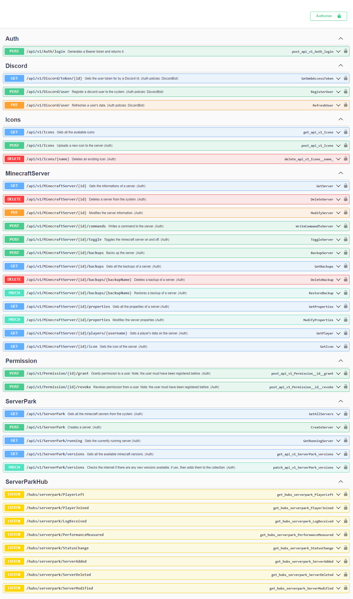
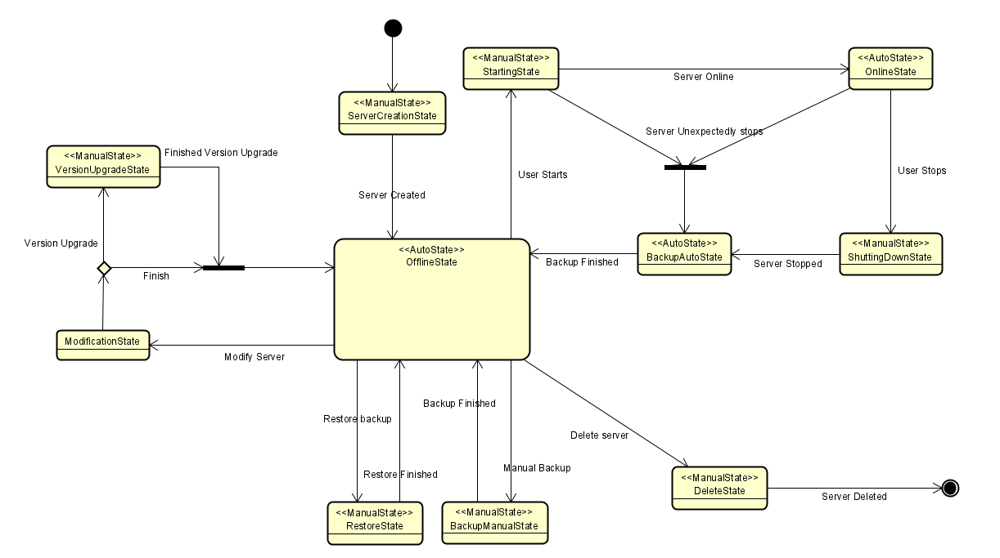

# MCServerBot
## Short Description
This project was created to make my friends able to 
start and stop a minecraft server which I hosted on my own computer. 
It started as a simple Discord bot, but eventually it became a much 
larger project than I thought. 

This project is WIP.

## Latest info
The clients and the server part has been separated, the clients (website and discord bot) 
does not work, they might not even compile, but the Web API works perfectly, and it is well documented.

## Features:
WEB API features:

- Auth
	- Currently the authentication flow is through the discord bot, which is not yet implemented. If you would like to still use the api, retrieve a test token by running the server and going to /api/v1/auth/login { "token": "test-acc", "platform": "discord"}

- Minecraft server features
	- Add a new server
	- Modify server name and version
	- Delete a server
	- Start and stop a server (only one active server at a time)
	- Get all the players who joined to the server and their online time
	- Get all the output of the minecraft server (including the commands of the players)
	- Write a command directly to the minecraft server process from the webapi
	- Change minecraft server properties file

- Permission system
	- Grant permission for a discord user to use the system
	- Revoke permission for a discord user to not allow to use the system

- Minecraft Versions
	- Add a new server with a specified minecraft version
	- If no version has been selected, then automatically the latest version will be used
	- Upgrade a server to a newer version
	- Downgrading a server to an older version is not allowed
	- The available version's info is downloaded from [the wiki](https://minecraft.fandom.com/wiki/Java_Edition_version_history), and the server.jar is automatically downloaded if it is not found in the local storage.
	- When creating a server or upgrading to a newer version, the server is set to a maintenance status. The maintenance is not started until a user manually starts the server. An other server can be started while there are servers in maintenance status.
	
- Backups and restores
	- User is able to manually backup a server if it is offline
	- The system automatically backs up a server when it has shut down after being online for longer than the specified time in the appsettings.json
	- User is able to restore manual and automatic backups.

## TODO:

1. Change websockets to SignalR (https://stackoverflow.com/questions/28948517/how-do-i-generate-api-documentation-for-signalr)
2. c# client + discord
3. js client + old page
4. new blazor pages
    - PWA for saving offline mode (make this optional for users)
    - Put the blazor pages to github (be able to select a host where to send the requests
    - skin viewer: https://github.com/rkkoszewski/minecraft-css-3d-skin-viewer
    - skin viewer 2: https://github.com/bs-community/skinview3d
    - skin api: https://mc-heads.net/avatar/Crash285
    - Map overview in browser
    - User click, mouse hover, uptime for webpage statistics
5. Minecraft command autocomplete
6. Request limiter (max server maintenance, max running server, stuff like these.

## Setup

### Web API
To set up the web api, download the whole project, 
go to the code/LogicAPI/MCWebAPI/Properties folder, copy the appsettings.json.example file and the launchSettings.json.example file,
rename them to appsettings.json and launchSettings.json respectively, and fill in the values.

# Technical information

## State Machine

A Minecraft server has a lot of functionalities, such as turning on/off, upgrading to a newer version, backing up automatically and manually, or restoring a backup, deleting a server. For keeping the codes separate and follow the Single Responsibility Principle from SOLID, these actions are separated into states. There are two types of state ManualState and AutoState. The AutoState is automatically triggered, while the ManualState is triggered by some kind of user action.

## Project structure

### Data Tier

- DataStorageSQLite: Implementation of the data dao interfaces used in the application logic
- DataStorageTest: Unit Testing for the dao interfaces. Now it is set up for the sqlite tests.

### Logic

- Shared: Model interfaces, EventHandlers, Exceptions, DTOs which are used in several projects across the system.
- Loggers: Collection of the loggers which are responsible for logging in the system
- HamachiCli: uses command line to extract data from hamachi console client, and execute other commands
- MCServerHandler: proxy for the minecraft server, due to the MCWebServer project is huge, and might contain bugs, or it may crash. It could possibly happen that the program crashes while the minecraft server stays online, and the only possible option to shut it down, is to kill the process from the Task Manager. To avoid that situation, MCServerHandler takes of the minecraft server's shutdown, by creating a thread that checks for the server.running file every 10 seconds. If this file is deleted, it will shut down the server the nicest way, so no progress is lost.
- Application: The main logic of the system. I have spent a lot of time to make this part well structured and to be easily maintainable. For example, check out the double proxy system for the ServerPark in the Application.Minecraft:
  - ServerPark: logging events, registering events to the database, disabling functionalities till the instance is initialized.
  - ServerParkInputValidation: All the checking happens here. Checks if the server which needs to be started exists, or if it is possible to delete a server, and so on.
  - ServerParkLogic: all the methods contain the pure functionalities without any checking or validations, because they are done in the above layer.

### LogicAPI

- APIModel: model interfaces and exceptions which are required for the api. Collection of DTOs, request and response types.
- MCWebAPI: ASP.NET Core Web API

### Presentation (WIP)

- Discord bot
- Webserver (blazor and razor)
- Arduino (this is still in the idea phase, therefore this will be the last thing which will be implemented)

Old website demo: 

